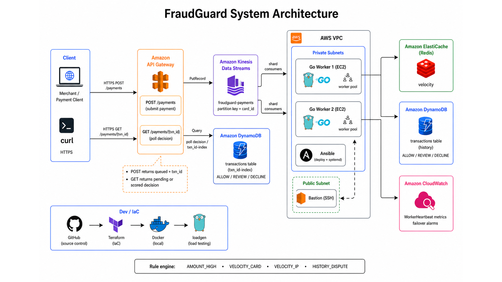

# FraudGuard

FraudGuard scores card payments for fraud risk in real time. A payment comes in, the system checks a few signals, and it returns one of three outcomes: allow it, send it for review, or decline it.

Under the hood this is a distributed backend on AWS. Several workers can score traffic at once, but they still reach the same answer because they share Redis velocity counters and DynamoDB history instead of keeping private state in memory.

| Decision | What it means |
|----------|---------------|
| `ALLOW` | Looks fine. Let it through. |
| `REVIEW` | Looks off. Have someone take a look. |
| `DECLINE` | Too risky. Block it. |

What I aimed for:

- Median scoring under 80ms under load
- 1,000+ TPS in the local load test
- Consistent decisions across workers
- Infra in Terraform, workers shipped with Ansible, health via CloudWatch

---

## Why build this?

Checkout is fast. Fraud checks that lag behind make the product feel broken.

One server eventually falls over when traffic spikes. Many servers sound better, until each one tracks “how many times this card paid recently” in its own memory. Then they disagree. One box allows a charge another would have stopped.

FraudGuard’s approach is simple:

1. Take payments in through a public API
2. Drop them on a stream so work can fan out
3. Score with shared rules and shared storage
4. Save the decision so you can audit it later

This is not a bank product and not an ML model. It’s a backend systems project: streaming, shared state, rule scoring, and cloud ops.

---

## Architecture



### What happens to a payment

1. **Something sends a payment.** A merchant backend, or you with `curl`, hits Amazon API Gateway over HTTPS.

2. **API Gateway puts it on Kinesis.** Think of Kinesis as a busy conveyor belt. Same card goes down the same lane (`card_id` partition key) so related activity stays ordered.

3. **Go workers on EC2 pick it up.** Each worker runs a pool of goroutines so it can score many payments in parallel.

4. **It checks shared state before deciding.**
   - Redis (ElastiCache): how chatty this card or IP has been in the last minute
   - DynamoDB: whether the card has dispute / fraud history

5. **Rules turn that into a score.** Points add up into ALLOW, REVIEW, or DECLINE, then the result is written to DynamoDB.

6. **You ask for the result.** `POST` only says `queued` and gives you a `txn_id`. Then call `GET /payments/{txn_id}`:
   - `pending` → still scoring
   - `scored` → includes `decision` and `score`

7. **Workers keep a heartbeat in CloudWatch.** If the heartbeat stops, an alarm fires.

### About the async API

On AWS, `POST /payments` comes back fast with `queued` plus a `txn_id`. That only means the payment entered the pipeline. To see ALLOW / REVIEW / DECLINE, poll `GET /payments/{txn_id}`. You don’t need the DynamoDB console for day-to-day checks.

That’s on purpose: keep the front door fast, let workers score in the background. Locally you can also run **score mode**, which returns the decision in the same response. Polling still works locally at `GET /v1/payments/{txn_id}`.

### Why Redis and DynamoDB?

| Store | Job | Rough analogy |
|-------|-----|---------------|
| Redis / ElastiCache | Hot, short-lived counters | A whiteboard of “how busy is this card right now?” |
| DynamoDB | Durable history | A filing cabinet of past txns and disputes |

Workers are stateless. If they only trusted their own RAM, replicas would drift under burst traffic.

---

## Rules (v1)

| Rule | Watches | Lives in |
|------|---------|----------|
| `AMOUNT_HIGH` | Amount over threshold (default $2,500) | Config |
| `VELOCITY_CARD` | Too many txns on one card in a short window | Redis |
| `VELOCITY_IP` | Too many txns from one IP in a short window | Redis |
| `HISTORY_DISPUTE` | Prior dispute / fraud flag on the card | DynamoDB |

Scoring:

- ≥ 80 → `DECLINE`
- ≥ 40 → `REVIEW`
- else → `ALLOW`

Same payment + same Redis/DynamoDB snapshot ⇒ same decision on every worker.

---

## Repo layout

| Path | What’s in it |
|------|--------------|
| `cmd/ingest` | HTTP entrypoint (local score mode or push to Kinesis) |
| `cmd/worker` | Kinesis consumer that scores on EC2 |
| `cmd/loadgen` | Throughput / latency harness |
| `internal/` | Rules, Redis, DynamoDB, stream helpers, scorer |
| `config/` | Sample local and AWS config |
| `terraform/` | VPC, API Gateway, Kinesis, Redis, DynamoDB, EC2, alarms |
| `ansible/` | Install worker binary + systemd |
| `images/` | Architecture diagram |
| `scripts/` | Smoke / LocalStack helpers |

---

## Run it locally first

You don’t need AWS to try the scoring path. Docker covers Redis and DynamoDB Local.

Needs Go 1.22+ and Docker Desktop running.

```bash
docker compose up -d redis dynamodb
make build
./bin/ingest -config config/local.yaml -mode score
```

Normal payment (expect `ALLOW`):

```bash
curl -s -X POST http://localhost:8080/v1/payments \
  -H 'Content-Type: application/json' \
  -d '{"card_id":"card-1","user_id":"u1","amount":42,"merchant":"Cafe","country":"US","ip":"1.2.3.4"}'
```

High amount (expect `REVIEW` from `AMOUNT_HIGH`):

```bash
curl -s -X POST http://localhost:8080/v1/payments \
  -H 'Content-Type: application/json' \
  -d '{"card_id":"card-hot","user_id":"u2","amount":3000,"merchant":"Luxury","country":"US","ip":"9.9.9.9"}'
```

In score mode the decision is already in the POST body. You can also fetch it later:

```bash
# swap in the txn_id from the POST response
curl -s http://localhost:8080/v1/payments/TXN_ID
```

Load test (~1k TPS):

```bash
./bin/loadgen -addr http://localhost:8080 -tps 1000 -duration 15s -workers 64
```

Handy Make targets:

```bash
make test   # rule engine unit tests
make up     # start Redis + DynamoDB Local
make down   # stop containers
```

---

## Deploy on AWS

This brings up the real pipeline: API Gateway, Kinesis, ElastiCache, DynamoDB, EC2 workers, a bastion for SSH, and CloudWatch alarms.

Heads up on cost: NAT Gateway and ElastiCache add up quickly. For a demo, apply, test, then destroy in the same sitting.

### 1. Tools and AWS login

```bash
brew install awscli terraform ansible
aws configure --profile fraudguard
export AWS_PROFILE=fraudguard
aws sts get-caller-identity
```

### 2. Infra

```bash
cd terraform
cp terraform.tfvars.example terraform.tfvars   # set key_name
terraform init
terraform apply
terraform output payments_url
```

### 3. Workers

```bash
# from repo root
GOOS=linux GOARCH=amd64 go build -o bin/worker ./cmd/worker

cd ansible
cp inventory.example.yml inventory.yml         # fill from terraform output
ansible-playbook -i inventory.yml site.yml --private-key ~/.ssh/fraudguard.pem
```

### 4. Hit it like a user

```bash
BASE="$(cd terraform && terraform output -raw payments_url)"

curl -s -X POST "$BASE" \
  -H 'Content-Type: application/json' \
  -d '{"card_id":"card-1","user_id":"u1","amount":42,"merchant":"Cafe","country":"US","ip":"1.2.3.4"}'

# {"status":"queued","txn_id":"...","poll":"/payments/..."}

curl -s "$BASE/TXN_ID"
# {"status":"scored","decision":"ALLOW","score":0, ...}
```

### 5. Shut it down

```bash
cd terraform
terraform destroy
```

---

## Safety

- Don’t commit `.env`, real `*.tfvars`, access-key CSVs, or private keys
- Tear the stack down when you’re done
- Tag resources with `Project=fraudguard` so cleanup is easy

## License

MIT
