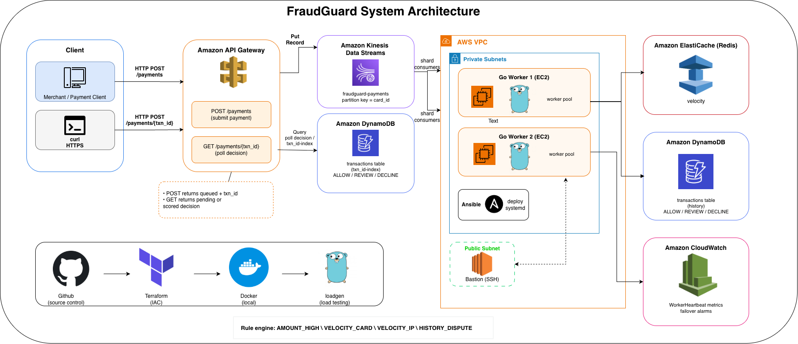

# FraudGuard



Distributed real-time fraud scoring pipeline on AWS. Payments enter through API Gateway into Kinesis; Go workers on EC2 apply shared rule checks using ElastiCache (Redis) velocity counters and DynamoDB transaction history, then expose the decision over `GET /payments/{txn_id}`.

| Decision | Meaning |
|----------|---------|
| `ALLOW` | Pass |
| `REVIEW` | Flag for manual review |
| `DECLINE` | Block |

**Targets:** sub-80ms median scoring latency under load, 1,000+ TPS in local loadgen, consistent decisions across workers via shared Redis/DynamoDB state. Infra is Terraform; workers deploy with Ansible; CloudWatch alarms watch worker heartbeats.

---

## Problem

Authorization paths need a fast risk decision. A single scorer does not survive burst traffic, and if each replica keeps velocity state in local memory, replicas diverge under concurrency.

FraudGuard keeps workers **stateless**:

1. Ingest via public API Gateway (`POST /payments`)
2. Fan-out on Kinesis (partition key = `card_id`)
3. Score with shared Redis + DynamoDB + pure rules
4. Persist the decision; clients poll `GET /payments/{txn_id}`

This is a backend systems project (streaming, shared state, ops). It is not a full bank product and not an ML model.

---

## Architecture

### Data path

1. **Client → API Gateway** over HTTPS (`POST /payments`).
2. **API Gateway → Kinesis** (`PutRecord`). Same `card_id` stays on one partition for ordering; different cards fan out across shards.
3. **EC2 Go workers** poll shards and score through a goroutine pool + channel.
4. **Shared state before decide**
   - Redis / ElastiCache: velocity windows (`vel:card:*`, `vel:ip:*`)
   - DynamoDB: durable history / dispute lookup
5. **Rule engine** produces ALLOW / REVIEW / DECLINE and writes the txn record.
6. **Client polls** `GET /payments/{txn_id}`
   - `pending` while scoring
   - `scored` with `decision` + `score`
7. **CloudWatch** `WorkerHeartbeat` metrics; missing heartbeats trip failover alarms.

### Async ingest

`POST /payments` returns quickly:

```json
{"status":"queued","txn_id":"...","poll":"/payments/..."}
```

That only means the event is on the stream. The decision comes from `GET /payments/{txn_id}` (DynamoDB GSI on `txn_id`). Local **score mode** can still return the decision inline for faster demos; polling works locally at `GET /v1/payments/{txn_id}` as well.

### Why Redis + DynamoDB

| Store | Role |
|-------|------|
| **ElastiCache Redis** | Hot velocity counters with TTL (sub-ms reads under burst) |
| **DynamoDB** | Durable txn history + dispute flag (system of record) |

Replicas stay consistent because scoring depends on shared stores, not process-local RAM.

Workers partition Kinesis shards by `worker_name` index and `worker_replicas` so multiple EC2 instances do not double-score the same records. Keep Ansible `worker_replicas` equal to the number of hosts in the workers group (Terraform `worker_count`).

---

## Rules (v1)

| Rule | Signal | Store |
|------|--------|-------|
| `AMOUNT_HIGH` | amount ≥ threshold (default $2500) | config |
| `VELOCITY_CARD` | N txns / card / window | Redis |
| `VELOCITY_IP` | N txns / IP / window | Redis |
| `HISTORY_DISPUTE` | prior dispute on card | DynamoDB |

Mark a scored txn as disputed (local ingest) so later payments on that card trip `HISTORY_DISPUTE`:

```bash
curl -s -X POST http://localhost:8080/v1/payments/TXN_ID/dispute \
  -H 'Content-Type: application/json' \
  -d '{"card_id":"card-1"}'
```

Score stack: ≥80 `DECLINE`, ≥40 `REVIEW`, else `ALLOW`. Rules are pure over `(payment, snapshot)` so any worker with the same snapshot scores the same way.

---

## Layout

| Path | Role |
|------|------|
| `cmd/ingest` | HTTP ingest (score mode or Kinesis put) + status poll |
| `cmd/worker` | Kinesis consumer (goroutine pool) |
| `cmd/loadgen` | TPS / p50 / p99 harness |
| `internal/` | engine, velocity, history, stream, scorer, cloudwatch |
| `config/` | `local.yaml`, `aws.yaml` |
| `terraform/` | VPC, API Gateway, Kinesis, ElastiCache, DynamoDB, EC2, alarms |
| `ansible/` | worker binary + systemd |
| `images/` | architecture diagram |
| `scripts/` | smoke / LocalStack helpers |

---

## Local

Needs Go 1.22+ and Docker Desktop.

```bash
docker compose up -d redis dynamodb
make build
./bin/ingest -config config/local.yaml -mode score
```

Normal payment (`ALLOW`):

```bash
curl -s -X POST http://localhost:8080/v1/payments \
  -H 'Content-Type: application/json' \
  -d '{"card_id":"card-1","user_id":"u1","amount":42,"merchant":"Cafe","country":"US","ip":"1.2.3.4"}'
```

High amount (`REVIEW` / `AMOUNT_HIGH`):

```bash
curl -s -X POST http://localhost:8080/v1/payments \
  -H 'Content-Type: application/json' \
  -d '{"card_id":"card-hot","user_id":"u2","amount":3000,"merchant":"Luxury","country":"US","ip":"9.9.9.9"}'
```

Poll by `txn_id`:

```bash
curl -s http://localhost:8080/v1/payments/TXN_ID
```

Loadgen (1k TPS):

```bash
./bin/loadgen -addr http://localhost:8080 -tps 1000 -duration 15s -workers 64
```

```bash
make test   # engine, velocity, shard-assignment unit tests
make up     # redis + dynamodb-local
make smoke  # POST payment then poll until scored
make down
```

---

## AWS

Provisions API Gateway, Kinesis, ElastiCache, DynamoDB (+ `txn_id-index` GSI), EC2 workers, bastion, CloudWatch.

**Cost:** NAT + ElastiCache dominate. Apply → smoke → `terraform destroy` in one sitting for demos.

### 1. Tooling

```bash
brew install awscli terraform ansible
aws configure --profile fraudguard
export AWS_PROFILE=fraudguard
aws sts get-caller-identity
```

### 2. Infra

```bash
cd terraform
cp terraform.tfvars.example terraform.tfvars   # set key_name
terraform init && terraform apply
terraform output payments_url
terraform output payment_status_url_template
```

### 3. Workers

```bash
GOOS=linux GOARCH=amd64 go build -o bin/worker ./cmd/worker
cd ansible
cp inventory.example.yml inventory.yml         # from terraform outputs
ansible-playbook -i inventory.yml site.yml --private-key ~/.ssh/fraudguard.pem
```

### 4. Client flow

```bash
BASE="$(cd terraform && terraform output -raw payments_url)"

curl -s -X POST "$BASE" \
  -H 'Content-Type: application/json' \
  -d '{"card_id":"card-1","user_id":"u1","amount":42,"merchant":"Cafe","country":"US","ip":"1.2.3.4"}'
# {"status":"queued","txn_id":"...","poll":"/payments/..."}

curl -s "$BASE/TXN_ID"
# {"status":"scored","decision":"ALLOW","score":0,...}
```

### 5. Teardown

```bash
cd terraform && terraform destroy
```

---

## Safety

- Do not commit `.env`, real `*.tfvars`, access-key CSVs, or PEM keys
- Set `ssh_ingress_cidr` in `terraform.tfvars` to your IP/32 before apply (default is open for demos)
- Destroy idle stacks
- Tag resources `Project=fraudguard`

## License

This project is licensed under the [MIT License](LICENSE).
